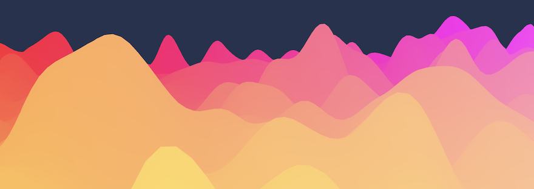

# Delta-V

A minty breath freshner for the large data visualization.

This framework simplifies some VERY difficult issues to address in handling graphics for
`large dynamic visualizations`.

## Installing

```sh
npm install -DE deltav
```

OR

```sh
yarn add deltav
```

OR

```sh
bun install
```

## Guide

This is the recommended reading for using this framework. More docs to come, but
plenty to get you rolling!

[The Guide](./docs/intro.md)

## Run Demos and modify the source code

Lots of demos available! Used to test and visualize the framework as development
is executed on it! This project has convertted over to preferring bun when you
can. Runs considerably faster for development.

```sh
bun run dev
```

Then visit http://localhost:6006

## Contributing

Make a PR. Make a very verbose description of what your changes accomplish.

You should probably file an issue as well for discussion and additional tracking.

Do NOT commit lock files.
